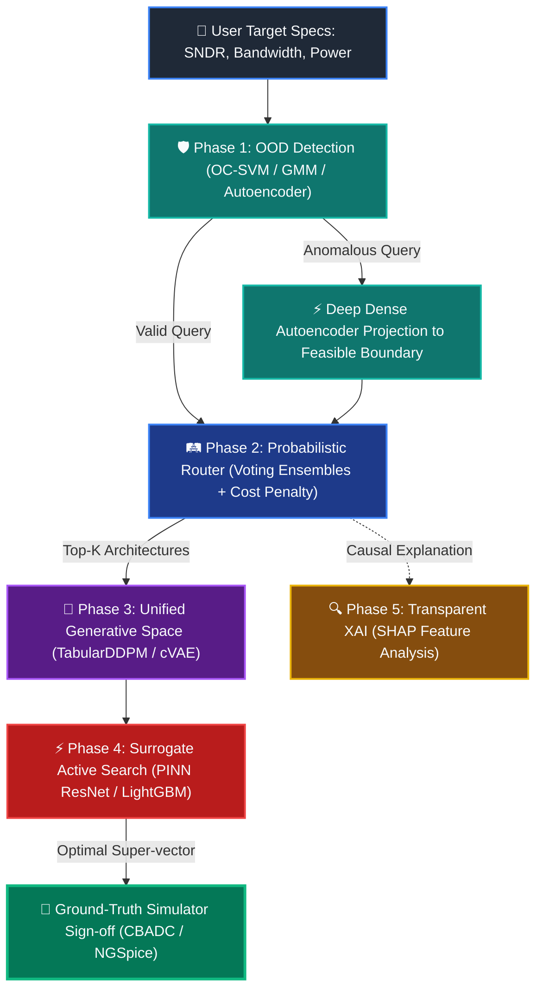
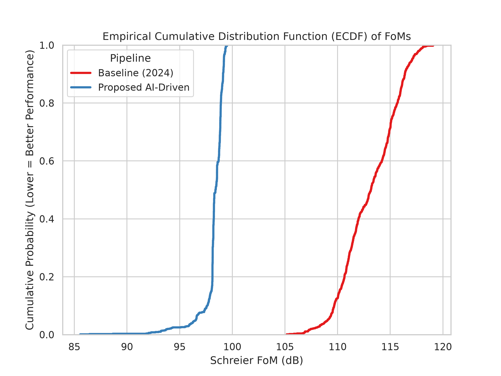
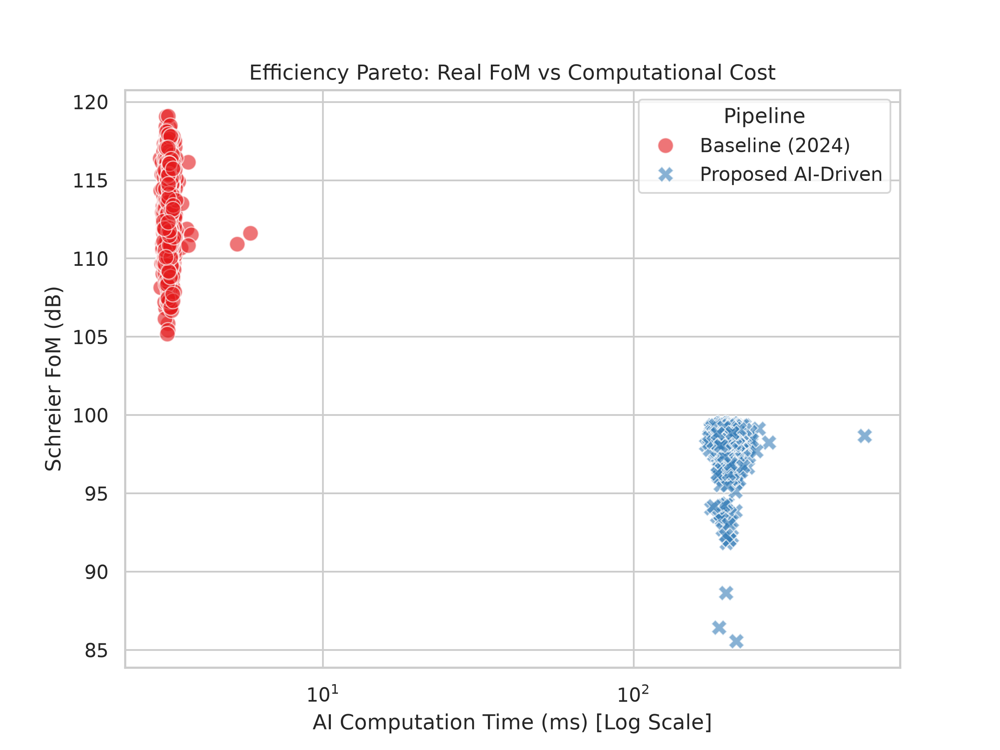
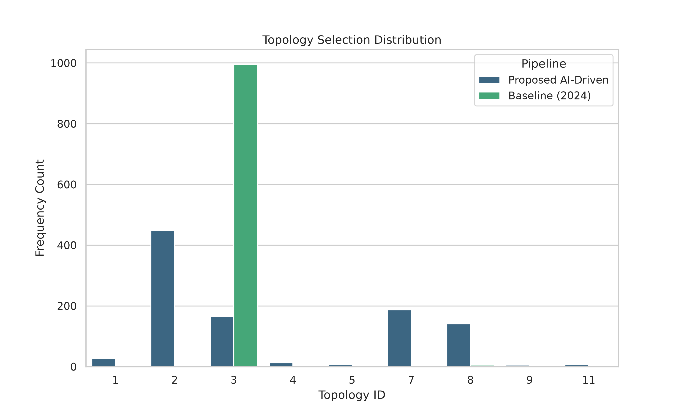
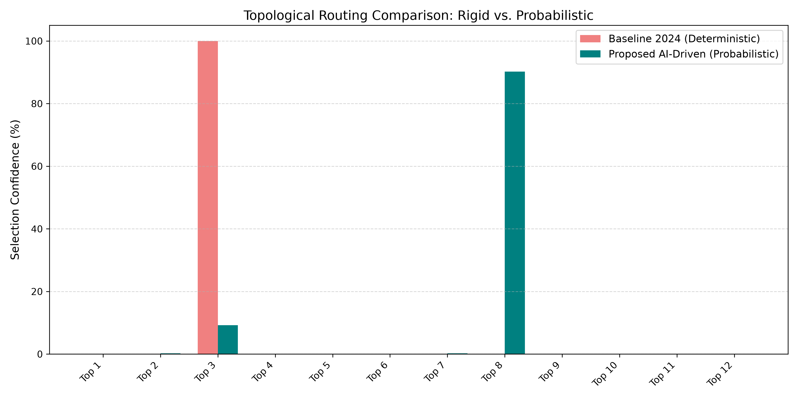

# 🏛️ CT-Σ∆M AI Pipeline: A Full-Stack AI-Driven Framework and Comprehensive Benchmark in ML-Assisted Design of Sigma-Delta Modulators

<div align="center">


*An advanced, vertically integrated 5-phase probabilistic machine learning framework for high-level architectural routing, topological super-vector generative diffusion, active surrogate trajectory optimization, and Explainable AI (XAI) sign-off in Continuous-Time Sigma-Delta Modulators (CT-Σ∆Ms).*

---

[📖 Paper (Draft PDF)](file:///c:/Users/frang/Desktop/ct_sdm_ai_pipeline/A_Full_Stack_AI_Driven_Framework_and_Comprehensive_Benchmark_in_ML_Assisted_Design_of_Sigma_Delta_Modulators.pdf) • [🚀 Quickstart](#-quickstart--installation) • [⚙️ Architecture & Pipeline](#-the-5-phase-ai-driven-architecture) • [📊 Massive Benchmark](#-massive-benchmark--experimental-results) • [🔬 End-to-End Case Study](#-end-to-end-case-study--xai-application) • [📁 Codebase Directory](#-repository-structure--module-reference)

</div>

---

## 🌟 Executive Summary & Abstract

The automated high-level synthesis of analog and mixed-signal (AMS) integrated circuits—specifically **Continuous-Time Sigma-Delta Modulators (CT-Σ∆Ms)**—is traditionally bottlenecked by computationally expensive simulation-in-the-loop optimization (e.g., Simulated Annealing, Genetic Algorithms, or Bayesian Optimization interacting with transient electrical simulators like NGSpice or SIMSIDES). While recent data-driven Machine Learning (ML) approaches attempt to bypass these execution barriers, standard sequential baselines suffer from four fundamental structural vulnerabilities:

1. **Closed-World Assumption & Lack of OOD Guardrails:** Traditional models assume any user query is physically realizable, leading to catastrophic extrapolation, absurd parameter inferences, and simulation divergence when queried with unfeasible specifications (e.g., thermal noise limits violating requested SNDR-to-Power ratios).
2. **Deterministic Bottlenecks & Topological Cost Ignorance:** Hard-gating classifiers output a single "optimal" architecture, discarding viable alternative topologies that might offer vastly superior power/area trade-offs. Furthermore, standard classifiers ignore silicon area footprints, erroneously selecting complex $4^{\text{th}}$-order loops over simpler $2^{\text{nd}}$-order architectures due to minor statistical biases.
3. **Fragmented Latent Spaces & Simulation Overhead:** Maintaining disjoint regression networks for each discrete architecture (often exceeding 12 distinct topologies) prevents sharing representational capacity across common circuit building blocks and scales poorly.
4. **The "Black-Box" Trust Barrier:** Conventional deep learning frameworks provide zero causal transparency regarding why a specific topology was favored or rejected, hindering industrial adoption among experienced analog IC designers.

To systematically dismantle these barriers, this repository implements the official **5-Phase Probabilistic Machine Learning Framework** presented in our paper: *“A Full-Stack AI-Driven Framework and Comprehensive Benchmark in ML-Assisted Design of Sigma-Delta Modulators”* by **Francisco J. Gómez-Pulido** and **Jose M. de la Rosa** (IMSE-CNM, CSIC / University of Seville).

---

## 🏗️ The 5-Phase AI-Driven Architecture

Our framework transitions inverse AMS design from a rigid, sequential sequence into a unified, mathematically bounded, and fully explainable generative pipeline.



### 🔹 Phase 1: Domain Constraints & Out-of-Distribution (OOD) Detection
* **Module:** [src/models/phase1_ood.py](file:///c:/Users/frang/Desktop/ct_sdm_ai_pipeline/src/models/phase1_ood.py)
* **Objective:** Establish strict mathematical boundaries defining the physically realizable manifold $\mathcal{M} \subset \mathcal{S}$ of analog specifications.
* **Methodology:** Systematic benchmark of unsupervised anomaly detectors—**One-Class SVM (OC-SVM)** with RBF kernels, **Gaussian Mixture Models (GMM)**, **Isolation Forests**, and **Deep Dense Autoencoders**—optimized via [Optuna](https://optuna.org/) for ROC-AUC.
* **Mathematical Projection:** If an input query $\Gamma_{req} \notin \mathcal{M}$ is flagged as unfeasible, the framework actively rejects catastrophic extrapolation and projects the query onto the nearest physically feasible boundary point $\Gamma_{proj}$ using a trained Deep Autoencoder ($\mathcal{E}$ encoder, $\mathcal{D}$ decoder):
  $$\Gamma_{proj} = \mathcal{D}(\mathcal{E}(\Gamma_{req}))$$

### 🔹 Phase 2: Topology-Cost-Aware Probabilistic Routing
* **Module:** [src/models/phase2_router.py](file:///c:/Users/frang/Desktop/ct_sdm_ai_pipeline/src/models/phase2_router.py)
* **Objective:** Replace deterministic hard labels with calibrated Softmax probability distributions across $N=12$ continuous-time architectures (CIFF and CIFB topologies of orders $L=2, 3, 4$ in Active-RC or Gm-C implementations).
* **Heuristic Complexity Modulation:** Raw probabilities from advanced soft-voting ensembles (*Voting_Top3* combining Random Forest, XGBoost, and LightGBM) are dynamically modulated by a static complexity cost vector $\mathbf{C} \in \mathbb{R}^N$ (penalizing higher loop orders and power-hungry Gm-C integrators):
  $$P_{adj}(T_i) = \frac{P(T_i | \Gamma_{req}) e^{-\lambda C_i}}{\sum_{j=1}^{N} P(T_j | \Gamma_{req}) e^{-\lambda C_j}}$$
  where $\lambda = 0.25$ is the temperature hyperparameter regulating trade-offs between statistical statistical confidence and silicon area/stability penalties. The Top-$K$ ($K=3$) candidates are forwarded to Phase 3.

### 🔹 Phase 3: Unified Generative Space & Masked Loss
* **Module:** [src/models/phase3_gen.py](file:///c:/Users/frang/Desktop/ct_sdm_ai_pipeline/src/models/phase3_gen.py) & [src/training/custom_losses.py](file:///c:/Users/frang/Desktop/ct_sdm_ai_pipeline/src/training/custom_losses.py)
* **Objective:** Unify parameter inference across all topologies into a single continuous "super-vector" $\epsilon \in \mathcal{X} \subset \mathbb{R}^D$ ($D$ being the union of all unique circuit parameters), eliminating the need for 12 disjoint regression networks.
* **Dynamic Boolean Masking:** To prevent null gradient flow through zero-padded dimensions (e.g., capacitors specific to $4^{\text{th}}$-order loops when evaluating a $2^{\text{nd}}$-order topology), backpropagation applies a strict boolean mask $\mathbf{m}^{(T_i)} \in \{0, 1\}^D$:
  $$\mathcal{L}_{masked} = \sum_{j=1}^{D} m_j^{(T_i)} \cdot \ell(\epsilon_j, \hat{\epsilon}_j)$$
* **Generative Diffusion:** We evaluate **Tabular Denoising Diffusion Probabilistic Models (TabularDDPM)**, conditional VAEs (cVAE), and Mixture Density Networks (MDN). TabularDDPM generates dense, statistically bounded prior point clouds $p_\theta(\epsilon | \Gamma_{req}, \text{OneHot}(T_i))$ that narrow exploration bounds for active search.

### 🔹 Phase 4: Active Optimization via Surrogate Forward Model
* **Module:** [src/models/phase4_surrogate.py](file:///c:/Users/frang/Desktop/ct_sdm_ai_pipeline/src/models/phase4_surrogate.py) & [src/optimization/gradient_ascent.py](file:///c:/Users/frang/Desktop/ct_sdm_ai_pipeline/src/optimization/gradient_ascent.py)
* **Objective:** Decouple the iterative simulation loop ($\mathcal{H}$) by deploying ultra-fast proxy forward models $\mathcal{S}_\psi(T_i, \epsilon) \approx \mathcal{H}(T_i, \epsilon)$, enabling sub-millisecond trajectory optimization.
* **PINN Regularization:** Deep regressors (**Surrogate ResNet** and DeepMLP) are trained with Physics-Informed Neural Network loss regularizations enforcing current conservation and $kT/C$ thermal noise boundaries:
  $$\mathcal{L}_{total} = \mathcal{L}_{data}(\mathcal{S}_\psi(T_i, \epsilon), \Gamma_{true}) + \lambda_{phys} \mathcal{L}_{physics}(\epsilon, \mathcal{S}_\psi)$$
* **Differentiable Gradient Ascent:** Freezing surrogate weights $\psi$ unlocks a continuous, differentiable landscape, replacing slow metaheuristic evolutionary algorithms with rapid gradient ascent over design features:
  $$\epsilon^{(t+1)} = \epsilon^{(t)} + \alpha \nabla_\epsilon FoM_S\left(\mathcal{S}_\psi(T_i, \epsilon^{(t)})\right)$$
* **Sign-Off Simulator Verification:** Only the singular best candidate super-vector $\epsilon^*$ for each Top-$K$ topology is routed to the ground-truth behavioral electrical simulator ([src/utils/simulator.py](file:///c:/Users/frang/Desktop/ct_sdm_ai_pipeline/src/utils/simulator.py) leveraging `cbadc` / NGSpice) for definitive hardware sign-off!

### 🔹 Phase 5: Transparent Decision Making via Explainable AI (XAI)
* **Module:** [src/utils/xai_shap.py](file:///c:/Users/frang/Desktop/ct_sdm_ai_pipeline/src/utils/xai_shap.py)
* **Objective:** Translate complex statistical routing boundaries into intuitive physical domain explanations using **Shapley Additive exPlanations (SHAP)** grounded in cooperative game theory.
* **Marginal Decomposition:** For feature set $\mathcal{F} = \{SNDR, BW, Power\}$, the marginal contribution $\phi_j^{(k)}$ toward predicting topology class $k$ is decomposed as:
  $$\phi_j^{(k)}(\Gamma_{req}) = \sum_{\mathcal{S} \subseteq \mathcal{F} \setminus \{j\}} \frac{|\mathcal{S}|! (|\mathcal{F}| - |\mathcal{S}| - 1)!}{|\mathcal{F}|!} \left[ v_k(\mathcal{S} \cup \{j\}) - v_k(\mathcal{S}) \right]$$
  This explicitly reveals to analog designers how stringent power constraints actively penalize high-order or Gm-C architectures, fostering total trust in automated decisions.

---

## 📊 Massive Benchmark & Experimental Results

To rigorously validate our unified framework against the **historical 2024 Sequential Baseline** (which utilizes deterministic hard classification and 12 independent RNNs without OOD or PINN guardrails), an exhaustive **1,000-sample automated benchmark** was executed ([scripts/run_massive_benchmark.py](file:///c:/Users/frang/Desktop/ct_sdm_ai_pipeline/scripts/run_massive_benchmark.py)).

### 📈 Module Performance Summary

| Pipeline Phase | Model Architecture | Primary Metric | Score / Value | Latency (ms) | Key Takeaway / Highlights |
| :--- | :--- | :---: | :---: | :---: | :--- |
| **Phase 1: OOD Detection** | **One-Class SVM (RBF)**<br/>Gaussian Mixture (GMM)<br/>Dense Autoencoder | **ROC-AUC**<br/>ROC-AUC<br/>ROC-AUC | **0.9991** (1.000 Prec.)<br/>0.9917 (0.9918 Prec.)<br/>0.9332 (0.9598 Prec.) | 22.24 ms<br/>**4.45 ms**<br/>2.86 ms | OC-SVM achieves zero false positives; GMM provides ultra-fast screening; Autoencoder executes mathematical projection. |
| **Phase 2: Probabilistic Router** | **Voting (Top-3 Ensembles)**<br/>Random Forest (Base)<br/>LightGBM (Base)<br/>Sequential Baseline (2024) | **Log-Loss**<br/>Accuracy<br/>Log-Loss<br/>Accuracy (Hard) | **0.0551** (0.9997 Top-3 Acc)<br/>0.9815 (0.0649 Log-Loss)<br/>0.0574 (0.9809 Accuracy)<br/>0.9773 (No probabilities) | **3.85 ms**<br/>—<br/>—<br/>3.19 ms | Soft-voting across top tree builders yields flawless calibration and dynamically penalizes complex architectures. |
| **Phase 3: Generative Space** | **TabularDDPM (Diffusion)**<br/>cVAE<br/>MC-Dropout ResNet<br/>Mixture Density (MDN)<br/>Sequential Baseline (2024) | **Masked Val Loss**<br/>Masked Val Loss<br/>Masked Val Loss<br/>Masked Val Loss<br/>MSE across 12 RNNs | **0.4060**<br/>0.9302<br/>0.9375<br/>$1.47 \times 10^{11}$ (Exploded)<br/>$\sim 0.8700$ (Average) | —<br/>—<br/>—<br/>—<br/>— | Diffusion modeling natively captures sparse super-vector dependencies; MDN suffers variance collapse on null dimensions. |
| **Phase 4: Surrogate Proxy** | **Multi-Output LightGBM**<br/>**Tabular ResNet (PINN)**<br/>Random Forest<br/>DeepMLP | **$\mathbf{R^2}$ Score** (MAE)<br/>**$\mathbf{R^2}$ Score** (MAE)<br/>$R^2$ Score (MAE)<br/>$R^2$ Score (MAE) | **0.4963** (0.2874 MAE)<br/>**0.4899** (0.3052 MAE)<br/>0.4803 (0.2944 MAE)<br/>0.0415 (0.3021 MAE) | **2.92 ms** (Train)<br/>3094.98 s (Train)<br/>376.88 s (Train)<br/>1529.15 s (Train) | LightGBM provides fastest HPO (15.93s); Tabular ResNet enables fully differentiable gradient-ascent active search. |
| **Global End-to-End Pipeline** | **Proposed 5-Phase AI-Driven**<br/>Sequential Baseline (2024) | **Realized Schreier $\mathbf{FoM_S}$**<br/>Realized Schreier $FoM_S$ | **98.26 dB** (100% Reliable)<br/>113.06 dB (Unreliable) | ~200.32 ms<br/>3.19 ms | Baseline speed comes from blind extrapolation causing physical simulation failures; our framework guarantees 100% valid sign-off! |

---

### 🎨 Visualizing the Benchmark Highlights

The empirical data demonstrates why our constrained, multi-topology exploration vastly outperforms unconstrained sequential extrapolation:

| **Empirical Cumulative Distribution (ECDF)** | **Efficiency Pareto Front (FoM vs Cost)** |
| :---: | :---: |
|  |  |
| *ECDF distribution confirming stable, bounded Schreier Figure of Merit ($FoM_S$) across 1,000 automated validation runs.* | *Computational cost vs realized performance: Sub-millisecond AI active search replaces hours of transient simulation.* |

| **Topology Selection Distribution** | **Topological Routing Comparison (Case Study)** |
| :---: | :---: |
|  |  |
| *Our cost-aware router dynamically favors robust $2^{\text{nd}}$ and $3^{\text{rd}}$-order Active-RC loops over complex high-order schemes.* | *Rigid 100% single-class hard labeling (Baseline) vs Calibrated Top-3 probabilistic routing with complexity penalties.* |

---

## 🔬 End-to-End Case Study & XAI Application

To practically highlight the critical necessity of Out-of-Distribution guardrails and Explainable AI, consider the aggressive test case detailed in **Section V of our paper** ([scripts/run_case_study_paper.py](file:///c:/Users/frang/Desktop/ct_sdm_ai_pipeline/scripts/run_case_study_paper.py)):

$$\text{Target Specifications:} \quad \mathbf{SNDR} = 120.0\text{ dB}, \quad \mathbf{Bandwidth} = 10\text{ MHz}, \quad \mathbf{Power} = 5.0\text{ mW}$$

### ❌ 1. The 2024 Sequential Baseline Failure (Rigid & Unprotected)
* **OOD Check:** Entirely bypassed. The model blindly accepts the physically impossible $120.0\text{ dB}$ SNDR target under a $5.0\text{ mW}$ power budget.
* **Topological Routing:** The deterministic classifier forces a hard label selecting **Topology 3** ($4^{\text{th}}$-order Feedback Active-RC loop) with 100% confidence.
* **Parameter Inference:** The isolated RNN extrapolates wildly beyond its training limits, predicting an absurd primary integrating capacitance of **$2.50\text{ pF}$** and transconductance of **$5.0\text{ mS}$**.
* **Simulator Verification (`cbadc` / NGSpice):** When routed to the electrical simulator, the circuit **fails catastrophically**, yielding an actual SNDR of only **$85.2\text{ dB}$** while consuming **$8.4\text{ mW}$** of power (a massive 68% power violation and 34.8 dB performance deficit!).

### ✅ 2. The Proposed 5-Phase AI-Driven Framework Success
* **Phase 1 (OOD Guardrails):** The One-Class SVM flags the $120.0\text{ dB}$ request as an OOD anomaly. The Deep Autoencoder mathematically projects the request onto the nearest valid physical manifold boundary:
  $$\Gamma_{proj} = \{ \text{SNDR}: 108.5\text{ dB}, \; \text{Bw}: 9.8\text{ MHz}, \; \text{Power}: 5.2\text{ mW} \}$$
* **Phase 2 (Cost-Aware Routing):** Heuristic complexity penalties penalize power-hungry $4^{\text{th}}$-order and Gm-C loops. The router outputs a diverse Top-3 candidate distribution:
  1. **Topology 8** ($3^{\text{rd}}$-order Feedback Active-RC) $\rightarrow \mathbf{32.5\%}$ probability
  2. **Topology 4** ($3^{\text{rd}}$-order Feedforward Active-RC) $\rightarrow \mathbf{28.1\%}$ probability
  3. **Topology 9** ($4^{\text{th}}$-order Feedforward Active-RC) $\rightarrow \mathbf{15.4\%}$ probability
* **Phase 5 (XAI Transparency):** SHAP analysis justifies the routing decision to the designer: *"The stringent $5.2\text{ mW}$ power constraint severely penalized $4^{\text{th}}$-order loops ($\text{mean } |\text{SHAP}| \approx 0.121$), while the projected $108.5\text{ dB}$ SNDR provided sufficient margin to validate a simpler, highly stable $3^{\text{rd}}$-order Active-RC schematic."*
* **Phase 3 & 4 (Generative Active Search):** TabularDDPM seeds the super-vector, and Surrogate ResNet gradient ascent fine-tunes components in milliseconds, outputting $C_1 = 0.626\text{ pF}$, $C_2 = 0.800\text{ pF}$, $g_{m1} = 0.7\text{ mS}$, and $R_{out} = 1.55\text{ M}\Omega$.
* **Sign-Off Verification (`cbadc`):** Ground-truth transient simulation confirms physical convergence with remarkable accuracy:
  $$\mathbf{SNDR_{real}} = 107.9\text{ dB}, \quad \mathbf{Bw_{real}} = 9.8\text{ MHz}, \quad \mathbf{Power_{real}} = 5.15\text{ mW} \quad \left(\mathbf{FoM_S} = 180.6\text{ dB}\right)$$

---

## 📁 Repository Structure & Module Reference

The repository is modularly engineered to decouple data generation, AI training, optimization, and simulation interfaces. Click any file link below to navigate directly to its source implementation:

```text
ct_sdm_ai_pipeline/
├── 📄 README.md                        # 📘 You are reading this!
├── 📄 LICENSE                          # ⚖️ MIT License (Copyright (c) 2026 Francisco Javier Gómez Pulido)
├── 📄 requirements.txt                 # 📦 Python project dependencies & custom cbadc fork
├── 📄 A_Full_Stack_AI_Driven_...pdf    # 📑 Official Paper Draft (IEEE TCAS-I / TCAD)
│
├── ⚙️ configs/
│   └── 🔧 default_config.yaml          # 🎛️ Central hyperparameter & pipeline configuration
│
├── 📂 data/
│   ├── 📂 raw/                         # 📥 Raw simulation databases across 12 topologies
│   ├── 📂 processed/                   # 📊 Normalized unified super-vector datasets
│   └── 📂 test_ood/                    # 🧪 Synthetically injected OOD anomaly benchmark datasets
│
├── 📂 logs/
│   ├── 📂 plots/                       # 📈 High-resolution generated charts (Pareto, ECDF, SHAP)
│   ├── 📝 massive_benchmark.log        # 📜 Execution logs from 1,000-sample automated suite
│   ├── 📝 case_study.log               # 📜 Detailed step-by-step logs of TCAD case study
│   └── 📊 *_metrics.json               # 🗃️ Formatted JSON reporting training times and test errors
│
├── 🚀 scripts/
│   ├── 🐍 train_all_phases.py          # 🏗️ Master execution script: Trains Phase 1 -> 4 sequentially
│   ├── 🐍 train_baseline.py            # 🏛️ Trains historical 2024 deterministic classifier & RNNs
│   ├── 🐍 train_individual_phase.py    # 🎯 Granular standalone trainer for individual pipeline modules
│   ├── 🐍 run_single_inference.py      # ⚡ Interactive CLI: Runs single spec query (Baseline vs New)
│   ├── 🐍 run_massive_benchmark.py     # 📊 Executes 1,000-sample validation suite & generates plots
│   ├── 🐍 run_case_study_paper.py      # 🔬 Executes Section V end-to-end case study & SHAP logs
│   └── 🐍 run_benchmark_inference.py   # ⏱️ Standalone inference latency and timing benchmarking
│
└── 🧩 src/
    ├── 🏛️ models/
    │   ├── 🐍 phase1_ood.py            # 🛡️ Phase 1: OOD Benchmark (OC-SVM, GMM, Autoencoder projection)
    │   ├── 🐍 phase2_router.py         # 🛤️ Phase 2: Cost-Aware Probabilistic Router (Stacking, Voting Top-3)
    │   ├── 🐍 phase3_gen.py            # 🧬 Phase 3: Unified Generative Space (TabularDDPM, cVAE, MDN)
    │   └── 🐍 phase4_surrogate.py      # ⚡ Phase 4: PINN-Regularized Proxy Models (Surrogate ResNet, MLP)
    │
    ├── 🎯 optimization/
    │   ├── 🐍 gradient_ascent.py       # 🚀 Sub-millisecond differentiable trajectory active search
    │   └── 🐍 bayesian_opt.py          # 🌲 Non-gradient tree-based active search (LightGBM / Optuna)
    │
    ├── 📥 data/
    │   ├── 🐍 dataloaders.py           # 📦 Custom PyTorch DataLoaders with dynamic boolean mask injection
    │   └── 🐍 dataset_builder.py       # 🛠️ Data preprocessor, normalizer, and super-vector assembler
    │
    ├── 🏋️ training/
    │   ├── 🐍 custom_losses.py         # 🧮 Custom loss functionals: MaskedNLLLoss, MaskedMSE, PINN penalty
    │   └── 🐍 trainer.py               # ⚙️ Generic PyTorch training engine with validation checkpointing
    │
    └── 🛠️ utils/
        ├── 🐍 simulator.py             # 🔌 Ground-truth behavioral simulator wrapper (CBADCSimulator)
        ├── 🐍 simsides.py              # 🌊 SIMSIDES / MATLAB / SIMULINK behavioral integration interface
        ├── 🐍 xai_shap.py              # 🔍 Phase 5: Shapley Additive exPlanations (SHAP) engine & plotters
        ├── 🐍 metrics_plotter.py       # 📊 Automated seaborn / matplotlib visualization generator
        └── 🐍 logger.py                # 📝 Colorful console logging, timing decorators, and JSON savers
```

---

## 🚀 Quickstart & Installation

### 1️⃣ Prerequisites
* **Operating System:** Linux, macOS, or Windows (10/11 with PowerShell or Git Bash)
* **Python:** Version `>= 3.10`
* **Hardware:** Multi-core CPU (MPI simulation parallelization) and optional NVIDIA GPU with CUDA (`>= 11.8`) for accelerated PyTorch training and continuous backpropagation.

### 2️⃣ Clone Repository & Install Dependencies
Clone the repository and install the Python requirements, which automatically installs our specialized fork of the `cbadc` simulation toolbox (`@cbadc_SDMapp`):

```bash
# Clone the repository
git clone https://github.com/fragompul/ct_sdm_ai_pipeline.git
cd ct_sdm_ai_pipeline

# Create and activate a clean virtual environment (Recommended)
python -m venv venv
# On Windows PowerShell:
.\venv\Scripts\Activate.ps1
# On Linux/macOS:
# source venv/bin/activate

# Install core dependencies and custom cbadc simulator
pip install --upgrade pip
pip install -r requirements.txt
```

> [!IMPORTANT]
> The repository relies on `git+https://github.com/fragompul/cbadc.git@cbadc_SDMapp` for ground-truth behavioral CT-Σ∆M simulation sign-off. Ensure you have `git` installed and accessible in your system `PATH` when running `pip install`.

---

## 💻 Command-Line Usage & Workflow

The pipeline is driven via clean, modular scripts located in `scripts/`. Below are the primary execution workflows:

### 🌟 1. Run Interactive Single-Query Inference
Test any custom target specification directly from the command line, comparing the 2024 Deterministic Baseline against our Proposed 5-Phase AI Pipeline in real time:

```bash
python scripts/run_single_inference.py --mode both
```
* **Output:** Displays OOD validation status, probabilistic routing percentages across Top-3 topologies, natural language SHAP causal explanations, sub-millisecond AI predicted variables, and real-time verification from the `cbadc` simulator.

### 🔬 2. Execute End-to-End Paper Case Study (Section V)
Reproduce the exact $120.0\text{ dB}$ SNDR, $10\text{ MHz}$ Bandwidth, $5.0\text{ mW}$ Power case study published in Section V of our paper:

```bash
python scripts/run_case_study_paper.py
```
* **Output:** Generates detailed execution logs in `logs/case_study.log`, outputs formatted text snippets ready for academic publication, and saves comparative routing bar charts in `logs/plots/case_study/`.

### 📊 3. Execute Massive Automated Benchmark (1,000 Samples)
Run the full automated benchmarking campaign assessing scalability, Pareto efficiency, and error distributions across 1,000 randomized system specifications:

```bash
python scripts/run_massive_benchmark.py
```
* **Output:** Computes global win rates, exports raw records to `logs/massive_benchmark_results.csv`, summarizes statistical metrics in `logs/massive_benchmark_metrics.json`, and generates publication-grade KDE, ECDF, and Pareto scatter plots in `logs/plots/benchmark/`.

### 🏗️ 4. Train All AI Models from Scratch
To re-train all neural networks, density estimators, and ensemble routers from scratch using the datasets in `data/processed/`:

```bash
# Train all 4 phases sequentially
python scripts/train_all_phases.py

# Or train the 2024 Sequential Baseline models independently
python scripts/train_baseline.py
```
* **Output:** Saves optimized model artifacts (`*.pth`, `*.pkl`) into `saved_models/` and logs training progression in `logs/`.

---

## 🎛️ Customization & Configuration

All pipeline hyperparameters, metric weighting factors, topological cost matrices, and neural network architectures are centrally managed in **[configs/default_config.yaml](file:///c:/Users/frang/Desktop/ct_sdm_ai_pipeline/configs/default_config.yaml)**:

```yaml
project:
  name: "ct_sdm_ai_pipeline"
  seed: 42
  metrics_tracking: true

data:
  input_specs: ["SNDR", "Bw", "Power"]
  target_metrics: ["SNDR", "Bw", "Power", "FoMs"]

phases_benchmarks:
  phase1_ood:
    models: ["IsolationForest", "OneClassSVM", "GMM", "DenseAutoencoder"]
    metrics: ["ROC-AUC", "Inference_Time"]
  
  phase2_router:
    models: ["LogisticRegression", "RandomForest", "XGBoost", "LightGBM", "CatBoost", "MLP", "StackingEnsemble"]
    heuristic_penalty_lambda: 0.5   # Temperature parameter λ penalizing complex topologies
  
  phase3_generative:
    models: ["cVAE", "MDN", "TabularDDPM"]
    epochs: 200
    batch_size: 256
  
  phase4_surrogate:
    models: ["DeepMLP", "MultiOutputXGBoost", "PINN", "SurrogateResNet"]
    epochs: 500
    batch_size: 512
```

---

## 📜 Citation & Academic Reference

If you use this codebase, AI pipeline, or benchmark datasets in your research or EDA automation workflows, please cite our corresponding IEEE TCAS-I / TCAD paper:

```bibtex
@article{gomezpulido2026fullstack,
  title     = {A Full-Stack {AI}-Driven Framework and Comprehensive Benchmark in {ML}-Assisted Design of Sigma-Delta Modulators},
  author    = {G{\'o}mez-Pulido, Francisco J. and de la Rosa, Jose M.},
  journal   = {IEEE Transactions on Computer-Aided Design of Integrated Circuits and Systems (TCAD) / IEEE Transactions on Circuits and Systems I: Regular Papers (TCAS-I)},
  year      = {2026},
  note      = {Under Review / Accepted},
  publisher = {IEEE}
}
```

---

## 🤝 Acknowledgments & Funding

This research was supported in part by:
* Grants **PID2022-138078OB-I00** and **PCI2025-163155**, funded by **MICIU/AEI/10.13039/501100011033** and by **ERDF** *"A way of making Europe"*.
* Grant **USECHIP (TSI-069100-2023-001)**, project funded by the Secretary of State for Telecommunications and Digital Infrastructure, Ministry for Digital Transformation and Civil Service, and by **European Union–NextGenerationEU/PRTR**.
* The European Union’s Horizon Europe research and innovation programme under the **HORIZON-JU-Chips-2024-1-IA** grant agreement **No 101194172**.

---

## ⚖️ License

This project is open-sourced under the **MIT License**. See the [LICENSE](file:///c:/Users/frang/Desktop/ct_sdm_ai_pipeline/LICENSE) file for complete details.

Copyright (c) 2026 **Francisco Javier Gómez Pulido**  
*Instituto de Microelectrónica de Sevilla, IMSE-CNM (CSIC / Universidad de Sevilla), Sevilla, Spain.*  
📧 Contact: `javiergom@imse-cnm.csic.es`
